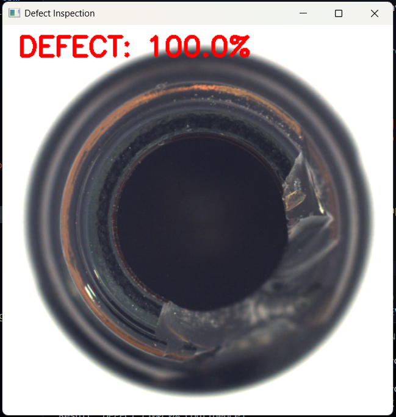
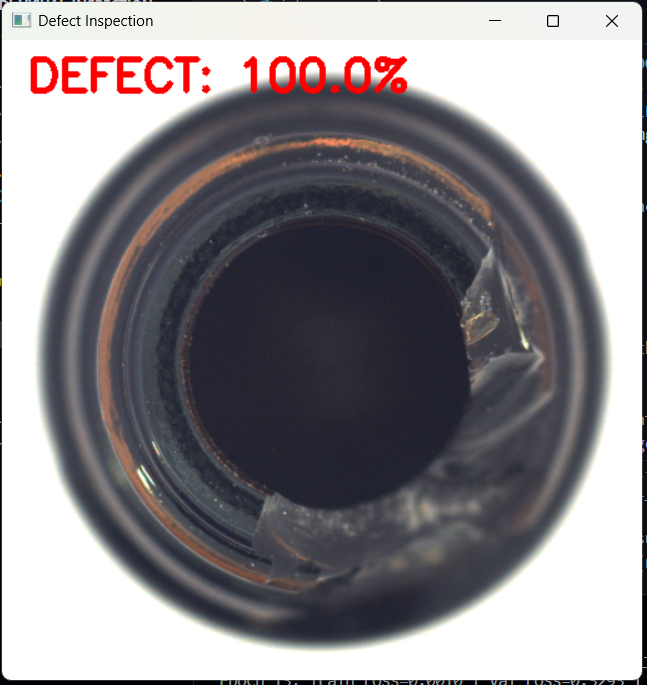
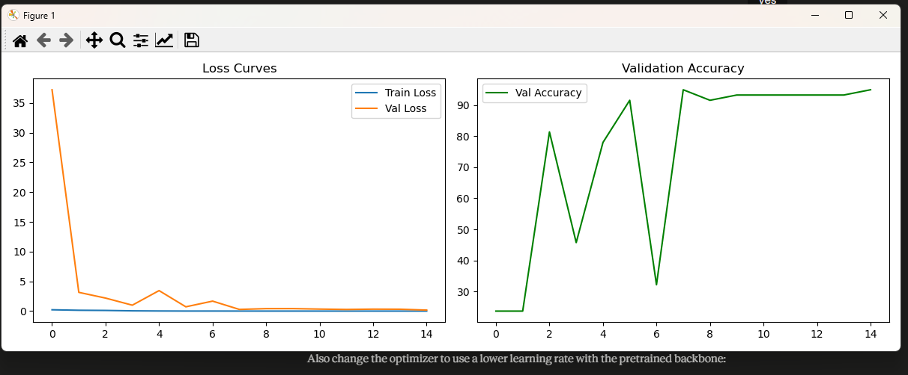

# Automated Visual Inspection -- Defect Detection

A PyTorch-based binary defect detection system trained on the 
MVTec Industrial Anomaly Detection dataset (bottle category).
Built as a prototype for manufacturing quality control applications.

## Results
- Validation Accuracy: 94.92%
- Architecture: ResNet18 (transfer learning from ImageNet)
- Dataset: MVTec AD -- Bottle category (229 good, 63 defective)
- Training: 15 epochs, RTX 3060 GPU

## Project Structure
audi-visual-inspection/
src/
model.py      -- ResNet18 classifier definition
train.py      -- Training pipeline with augmentation
inference.py  -- OpenCV inference on images or folders
README.md

## How to Run

### Install dependencies
```bash
pip install torch torchvision opencv-python matplotlib pillow scikit-learn tqdm
```

### Train
```bash
cd src
python train.py
```

### Run inference on single image
```bash
python inference.py path/to/image.png
```

### Run inference on folder
```bash
python inference.py path/to/folder/
```

## Key Design Decisions

**Why ResNet18?**
Small dataset (292 images) benefits from transfer learning. 
ResNet18 pretrained on ImageNet already knows edges and textures. 
Only the final classification layer is retrained.

**Why weighted CrossEntropyLoss?**
Dataset is imbalanced -- 229 good vs 63 defective. 
Weighted loss penalises missing a defect more than 
misclassifying a good part, reflecting real manufacturing cost.

**Why StepLR scheduler?**
Halves learning rate every 5 epochs. Large steps early for 
fast convergence, small steps later for fine-tuning.

## Sample Results
- Good bottle: GOOD 99.9% confidence
- Defective bottle: DEFECT 100.0% 

## Demo

### Defect Detected


### Good Part


## Training Curves


## Next Steps
- Object detection with bounding boxes using YOLO
- Anomaly detection using PatchCore for rare defect types
- Evaluation using F1-score and recall metrics
- Edge deployment optimisation for real-time production line use
